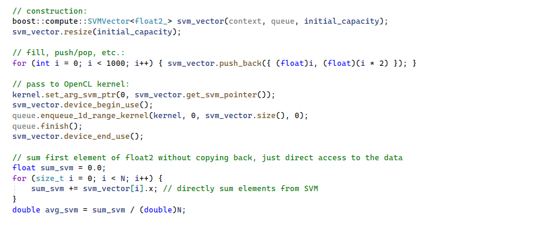
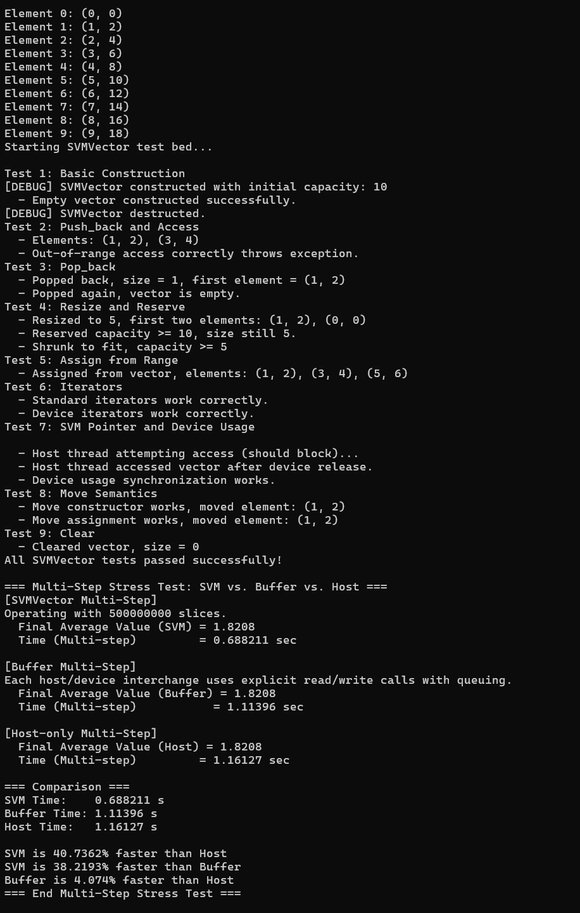

# SVMVector
Boost expansion for easy to use stl-like templated vector with shared memory (opencl 2.0+)

SVMVector - Shared Virtual Memory Vector for Boost.Compute OpenCL
 Author: Joshua Diyn
 Copyright (c) 2025
 Date: 30/03/2025

 The SVM Vector Class is a simpler way to interact with Boost's implementation of the
 Shared Virtual Memory (SVM). It provides a vector-like container that uses
 fine-grained SVM in OpenCL 2.0 or later. It allows both host and device
 to access the same underlying memory without copying data back and forth.
 A simple locking mechanism is included to avoid race conditions:
   - device_begin_use() indicates the device is about to operate on the vector,
   - device_end_use() indicates completion,
 so host operations block if the device is currently using the vector.

 Methods provided include: push_back, pop_back, at, set, resize, reserve,
 shrink_to_fit, assign, clear, begin/end iterators, and get_svm_pointer().
 Copy constructors are disabled; only move semantics are supported.
 Allocations are performed with boost::compute::svm_alloc / svm_free and
 automatically expand as needed.
 

## Dependencies:
 1. Ensure your project has boost compute headers as additional includes
 2. Ensure project includes cl directory
 3. Ensure opencl.lib included in your project
 

 Usage example:

   // construction:
   
   boost::compute::SVMVector<float2_> svm_vector(context, queue, initial_capacity);

   // fill, push/pop, etc.:
   
   for (int i = 0; i < 1000; i++) {
       svm_vector.push_back({(float)i, (float)(i * 2)});
   }

   // pass to OpenCL kernel:
   
   kernel.set_arg_svm_ptr(0, svm_vector.get_svm_pointer());
   svm_vector.device_begin_use();
     queue.enqueue_1d_range_kernel(kernel, 0, svm_vector.size(), 0);
     queue.finish();
   svm_vector.device_end_use();
   
   

 Ensure your device supports CL_DEVICE_SVM_FINE_GRAIN_BUFFER, or else this
 class will not function properly.
